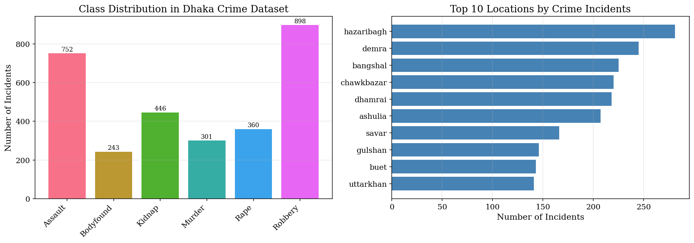
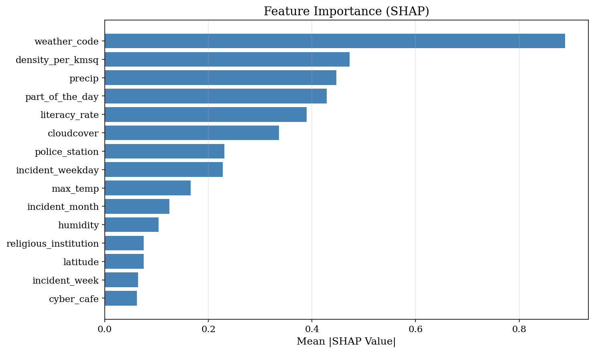
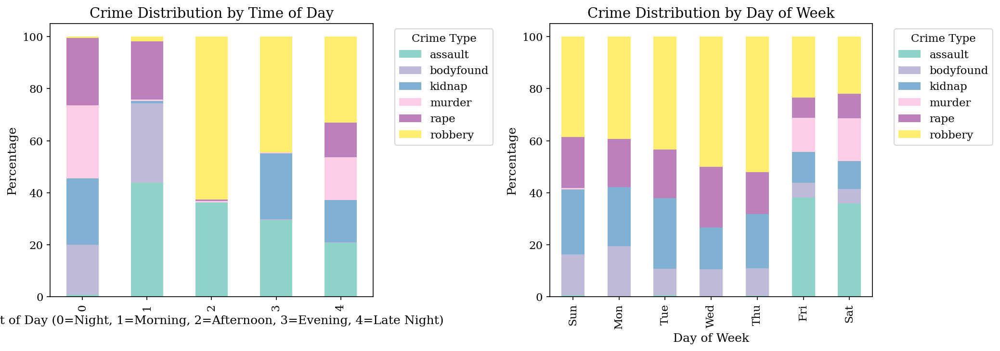
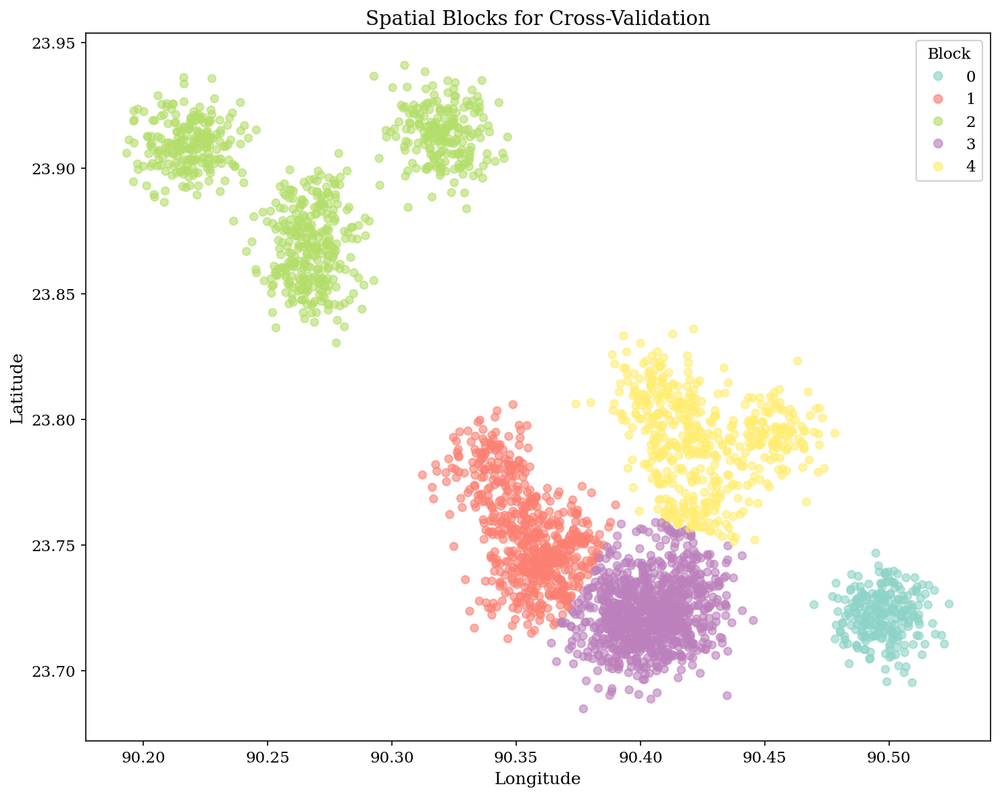
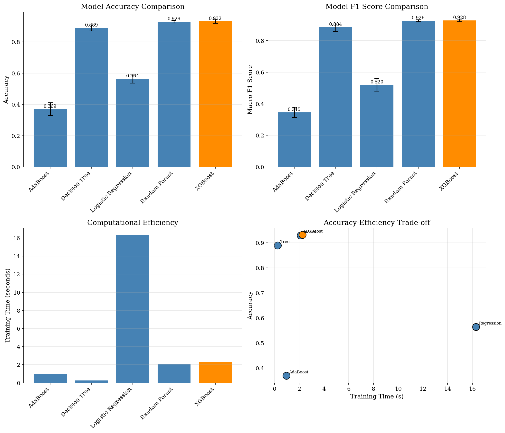
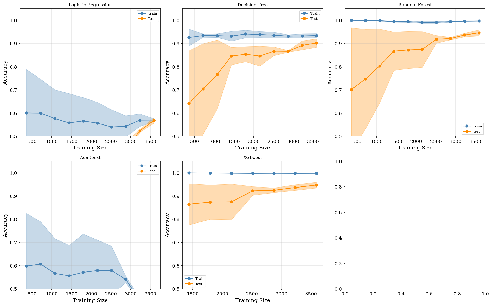
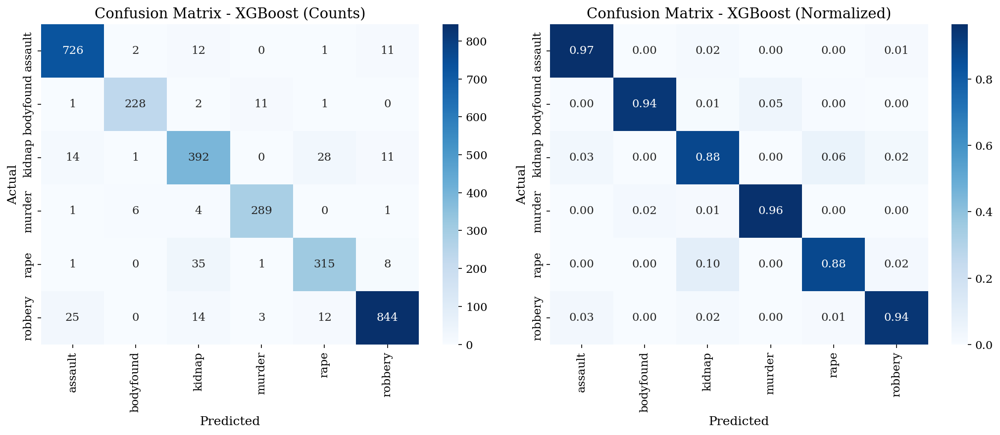
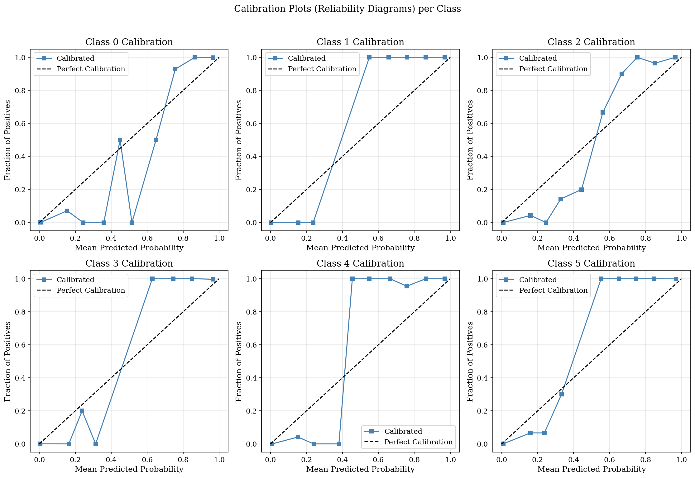
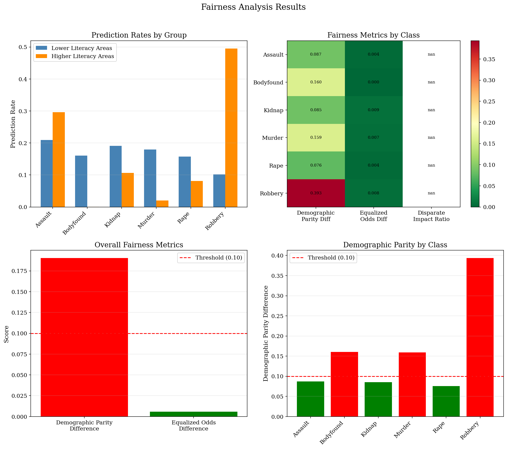
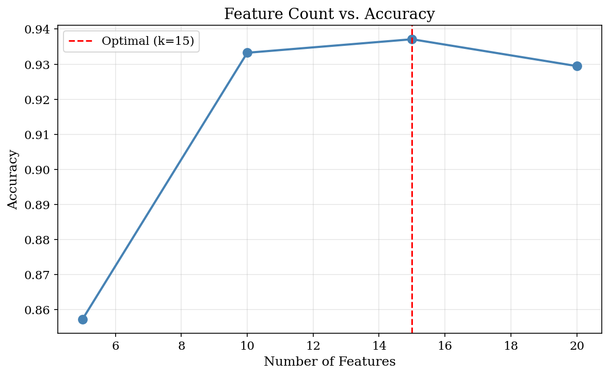

# 🔍 Fairness-Aware Crime Classification for Dhaka Metropolitan Area

<p align="center">
  
  
  
  
  
</p>

> A machine learning pipeline for multiclass crime classification using the **Dhaka Metropolitan Crime Dataset** (3,000 incidents, 6 crime types, 37 features). Implements SMOTE-NC for class imbalance, spatiotemporal cross-validation, SHAP-based feature selection, probability calibration, and fairness auditing via FairLearn.

---

## 📋 Table of Contents

- [Overview](#-overview)
- [Dataset](#-dataset)
- [Pipeline Architecture](#-pipeline-architecture)
- [Results](#-results)
- [Visualizations](#-visualizations)
- [Fairness Analysis](#-fairness-analysis)
- [Installation](#-installation)
- [Usage](#-usage)
- [Project Structure](#-project-structure)
- [Key Findings](#-key-findings)
- [Limitations & Future Work](#-limitations--future-work)

---

## 🌐 Overview

This project tackles **automated crime type classification** in Dhaka, Bangladesh — a domain where class imbalance, spatial autocorrelation, and fairness concerns demand careful methodology. The pipeline goes beyond standard ML workflows by addressing:

| Challenge | Our Solution |
|---|---|
| Class imbalance (3.7× ratio) | SMOTE-NC (mixed categorical + numerical oversampling) |
| Spatial autocorrelation | K-Means spatial block cross-validation (5 blocks) |
| Feature redundancy | SHAP-based top-K feature selection |
| Overconfident predictions | Platt scaling calibration (ECE = 0.0432) |
| Algorithmic fairness | FairLearn — demographic parity & equalized odds |
| Interpretability | SHAP TreeExplainer for global & local explanations |

---

## 📦 Dataset

**Dhaka Metropolitan Crime Dataset** — 3,000 crime incidents across Dhaka Division.

```
Dataset shape : (3000, 37)
Crime classes : assault, bodyfound, kidnap, murder, rape, robbery
Imbalance ratio: 3.70 (robbery=898, bodyfound=243)
```

### Feature Groups

| Category | Features |
|---|---|
| **Temporal** | `incident_month`, `incident_week`, `incident_weekday`, `weekend`, `part_of_the_day` |
| **Spatial** | `latitude`, `longitude`, `incident_place`, `incident_district`, `incident_division` |
| **Weather** | `max_temp`, `avg_temp`, `min_temp`, `weather_code`, `precip`, `humidity`, `visibility`, `cloudcover`, `heatindex`, `season` |
| **Socioeconomic** | `household`, `male_population`, `female_population`, `total_population`, `gender_ratio`, `avg_household_size`, `density_per_kmsq`, `literacy_rate` |
| **Infrastructure** | `religious_institution`, `playground`, `park`, `police_station`, `cyber_cafe`, `school`, `college`, `cinema` |

### Class Distribution

```
robbery    898  ████████████████████████  29.9%
assault    752  ████████████████████      25.1%
kidnap     446  ████████████             14.9%
rape       360  ██████████               12.0%
murder     301  ████████                 10.0%
bodyfound  243  ██████                    8.1%
```

---

## 🏗️ Pipeline Architecture

```
Raw CSV (3000 × 37)
        │
        ▼
┌─────────────────────┐
│   Data Cleaning     │  IQR capping (1st–99th pct), de-duplication
└────────┬────────────┘
         │
         ▼
┌─────────────────────┐
│ Feature Engineering │  LabelEncoder (categorical), RobustScaler
└────────┬────────────┘
         │
         ▼
┌─────────────────────┐
│  SHAP Feature       │  Preliminary XGBoost → mean |SHAP| ranking
│  Selection (Top 10) │  Top features: weather_code, density_per_kmsq,
└────────┬────────────┘  precip, part_of_the_day, literacy_rate ...
         │
         ▼
┌──────────────────────────────────────────┐
│  Spatiotemporal Cross-Validation         │
│  Outer: 5 spatial blocks (K-Means)       │
│  Inner: 3-fold Stratified CV             │
│  + SMOTE-NC (k=5) on training folds      │
└────────┬─────────────────────────────────┘
         │
         ▼
┌─────────────────────────────────────────────────────┐
│  Model Zoo                                          │
│  • Logistic Regression  • Decision Tree             │
│  • Random Forest        • AdaBoost                  │
│  • XGBoost (★ Best)                                 │
└────────┬────────────────────────────────────────────┘
         │
         ▼
┌──────────────────────────┐
│  Platt Scaling           │  CalibratedClassifierCV (sigmoid, cv=5)
│  Calibration             │  ECE = 0.0432
└────────┬─────────────────┘
         │
         ├──► Fairness Audit  (FairLearn: DP diff, EO diff)
         ├──► Threshold Analysis (τ=0.50 vs τ=0.65)
         └──► Feature Ablation (k=5,10,15,20)
```

---

## 📊 Results

### Model Comparison (5-Fold Spatial CV, Mean ± Std)

| Model | Accuracy | Macro F1 | AUC-ROC | Train Time |
|---|---|---|---|---|
| **XGBoost** ⭐ | **0.9317 ± 0.0126** | **0.9276 ± 0.0075** | **0.9945 ± 0.0014** | 2.3s |
| Random Forest | 0.9291 ± 0.0084 | 0.9265 ± 0.0058 | 0.9916 ± 0.0027 | 2.1s |
| Decision Tree | 0.8892 ± 0.0194 | 0.8845 ± 0.0261 | 0.9736 ± 0.0083 | 0.3s |
| Logistic Reg. | 0.5642 ± 0.0283 | 0.5196 ± 0.0400 | 0.8775 ± 0.0122 | 16.3s |
| AdaBoost | 0.3695 ± 0.0411 | 0.3451 ± 0.0326 | 0.8531 ± 0.0145 | 0.9s |

### Statistical Significance (vs. Logistic Regression Baseline, Paired t-test)

| Model | ΔF1 | p-value | Cohen's d |
|---|---|---|---|
| XGBoost | +0.4080 | p < 0.001 *** | 15.84 |
| Random Forest | +0.4069 | p < 0.001 *** | 15.91 |
| Decision Tree | +0.3649 | p < 0.001 *** | 12.08 |
| AdaBoost | −0.1745 | p < 0.001 *** | −5.34 |

### XGBoost Classification Report

| Crime | Precision | Recall | F1 | Support |
|---|---|---|---|---|
| Assault | 0.95 | 0.97 | **0.96** | 752 |
| Bodyfound | 0.96 | 0.94 | **0.95** | 243 |
| Kidnap | 0.85 | 0.88 | **0.87** | 446 |
| Murder | 0.95 | 0.96 | **0.96** | 301 |
| Rape | 0.88 | 0.88 | **0.88** | 360 |
| Robbery | 0.96 | 0.94 | **0.95** | 898 |
| **Macro avg** | **0.93** | **0.93** | **0.93** | 3000 |

---

## 🖼️ Visualizations

### 1. Class Distribution & Top Crime Locations


> Left: Crime type counts (Robbery dominates at 898 incidents). Right: Top 10 locations — Hazaribagh leads with ~250 incidents.

---

### 2. SHAP Feature Importance


> `weather_code` is the strongest predictor (mean |SHAP| = 0.889), followed by `density_per_kmsq`, `precip`, and `part_of_the_day`. Infrastructure and literacy features round out the top 10.

**Top 15 SHAP Features:**

| Rank | Feature | Mean \|SHAP\| |
|---|---|---|
| 1 | `weather_code` | 0.8887 |
| 2 | `density_per_kmsq` | 0.4727 |
| 3 | `precip` | 0.4474 |
| 4 | `part_of_the_day` | 0.4284 |
| 5 | `literacy_rate` | 0.3896 |
| 6 | `cloudcover` | 0.3362 |
| 7 | `police_station` | 0.2308 |
| 8 | `incident_weekday` | 0.2275 |
| 9 | `max_temp` | 0.1660 |
| 10 | `incident_month` | 0.1246 |

---

### 3. Spatiotemporal Crime Patterns


> Crime type mix varies by time-of-day (part 0=Night shows robbery-heavy patterns) and by weekday (Wednesday spikes for certain violent crimes).

---

### 4. Spatial Blocks for Cross-Validation


> 5 geographically coherent blocks created via K-Means on (lat, lon). Block sizes: [245, 632, 723, 910, 490] — ensures train/test sets are spatially disjoint, preventing data leakage from spatial autocorrelation.

---

### 5. Model Performance Comparison


> XGBoost and Random Forest dominate in accuracy and F1. Logistic Regression is the slowest (16s) yet weakest. AdaBoost collapses on this imbalanced multiclass problem.

---

### 6. Learning Curves


> XGBoost and Random Forest show healthy convergence (training and test curves narrowing). AdaBoost exhibits high variance. Decision Tree overfits at smaller training sizes before stabilizing.

---

### 7. Confusion Matrix — XGBoost


> Near-diagonal confusion matrix. Main misclassification: Kidnap ↔ Rape (35 instances). Assault and Robbery are predicted near-perfectly.

---

### 8. Calibration Plots (Reliability Diagrams)


> Post Platt-scaling calibration curves closely follow the diagonal (perfect calibration line). ECE = **0.0432** overall; per-class ECE ranges from 0.0074 (Murder) to 0.0197 (Robbery).

**Calibration by Confidence Bin:**

| Confidence Bin | Accuracy | Proportion |
|---|---|---|
| [0.4, 0.5) | 0.000 | 0.03% |
| [0.5, 0.6) | 0.800 | 0.33% |
| [0.6, 0.7) | 0.842 | 1.27% |
| [0.7, 0.8) | 0.971 | 3.47% |
| [0.8, 0.9) | 0.988 | 2.70% |
| **[0.9, 1.0)** | **0.999** | **92.2%** |

> 92.2% of predictions fall in the highest confidence bin with 99.9% accuracy — the model is highly confident and well-calibrated.

---

### 9. Fairness Analysis


> Sensitive feature: literacy rate (median split → Low/High Literacy Areas). Demographic parity is a concern for Robbery class (DP diff = 0.393). Equalized Odds is fair across all classes (avg = 0.0058).

---

### 10. Feature Ablation Study


> Performance peaks at **k=15 features** (Acc=0.9371, F1=0.9332). Using only 5 features drops accuracy by ~8%. Beyond 15, performance slightly degrades due to noise from less-informative features.

| Features | Accuracy | Macro F1 | vs. Baseline |
|---|---|---|---|
| Top 5 | 0.8572 | 0.8549 | Baseline |
| Top 10 | 0.9332 | 0.9288 | +0.076 |
| **Top 15** ⭐ | **0.9371** | **0.9332** | **+0.080** |
| Top 20 | 0.9294 | 0.9235 | +0.072 |

---

## ⚖️ Fairness Analysis

Fairness was evaluated using **FairLearn** with literacy rate as a proxy sensitive attribute (binary: below/above median).

| Crime Class | DP Difference | EO Difference | Verdict |
|---|---|---|---|
| Assault | 0.0870 | 0.0041 | ✅ Fair |
| Bodyfound | 0.1601 | 0.0000 | ⚠️ DP concern |
| Kidnap | 0.0850 | 0.0090 | ✅ Fair |
| Murder | 0.1593 | 0.0074 | ⚠️ DP concern |
| Rape | 0.0759 | 0.0039 | ✅ Fair |
| Robbery | **0.3933** | 0.0075 | ❌ DP violation |

**Overall (weighted avg):**
- Demographic Parity Difference: **0.1902** → ⚠️ CONCERN (threshold: 0.10)
- Equalized Odds Difference: **0.0058** → ✅ FAIR (threshold: 0.10)

> The equalized odds metric being near-zero suggests that **once crime occurs**, the model predicts equally well across literacy-area groups. The demographic parity concern is partially structural — literacy-rate correlates with actual crime type distributions in Dhaka.

---

## 🔧 Installation

### Requirements

```bash
pip install numpy pandas scipy matplotlib seaborn scikit-learn
pip install xgboost imbalanced-learn fairlearn shap
pip install tqdm joblib
```

Or install all at once:

```bash
pip install -r requirements.txt
```

### `requirements.txt`

```
numpy>=1.24.0
pandas>=2.0.0
scipy>=1.11.0
matplotlib>=3.7.0
seaborn>=0.12.0
scikit-learn>=1.3.0
xgboost>=2.0.0
imbalanced-learn>=0.11.0
fairlearn>=0.9.0
shap>=0.43.0
tqdm>=4.65.0
joblib>=1.3.0
```

---

## 🚀 Usage

### Google Colab (Recommended)

1. Upload your dataset to Google Drive:
   ```
   /content/drive/MyDrive/DATASETS_For the data analysis/crime_dataset.csv
   ```

2. Open `crime_Analysis.ipynb` in Colab and run all cells sequentially.

### Local Execution

```bash
git clone https://github.com/yourusername/dhaka-crime-classification.git
cd dhaka-crime-classification

# Update the dataset path in Cell 2:
# df = pd.read_csv("path/to/crime_dataset.csv")

jupyter notebook crime_Analysis.ipynb
```

### Cell-by-Cell Guide

| Cell | Description |
|---|---|
| 1 | Environment setup & imports |
| 2 | Load dataset & initial exploration |
| 3 | Data cleaning (outlier capping, deduplication) |
| 4 | Feature engineering & target encoding |
| 5 | Data distribution visualization |
| 6 | SHAP feature importance (preliminary XGBoost) |
| 7 | Spatiotemporal pattern analysis |
| 8 | Spatial block CV split creation |
| 9 | Model definitions |
| 10 | SMOTE-NC parameter ablation |
| 11 | Main training loop (nested spatiotemporal CV) |
| 12 | Aggregate results & statistical significance |
| 13 | Confusion matrix for best model |
| 14 | Per-class recall: SMOTE vs. baseline |
| 15 | Model comparison visualization |
| 16 | Learning curves |
| 17 | Probability calibration (Platt scaling + ECE) |
| 18 | Fairness analysis (FairLearn) |
| 19 | False positive rate vs. conservative threshold |
| 20 | Feature ablation study |
| 21 | Overfitting analysis (train-test gap) |

---

## 📁 Project Structure

```
dhaka-crime-classification/
│
├── crime_Analysis.ipynb          # Main notebook (21 cells)
├── README.md                     # This file
├── requirements.txt              # Python dependencies
│
├── data/
│   └── crime_dataset.csv         # Dhaka crime dataset (3000 × 37)
│
└── outputs/
    ├── Data_Distribution.png     # Class dist + top locations
    ├── Feature_Importance.png    # SHAP bar chart
    ├── Spatiotemporal_Patterns.png
    ├── Spatial_Blocks.png        # K-Means geographic blocks
    ├── Model_Comparison.png      # Bar + scatter comparison
    ├── Learning_Curves.png       # Per-model learning curves
    ├── Confusion_Matrix.png      # XGBoost confusion matrix
    ├── Calibration_Plots.png     # Per-class reliability diagrams
    ├── Calibration_Plot_Overall.png
    ├── Fairness_Analysis.png     # FairLearn visualizations
    └── Feature_Ablation.png      # k vs. accuracy curve
```

---

## 🔑 Key Findings

1. **Weather dominates crime type prediction.** `weather_code` has a SHAP importance of 0.889 — nearly 2× the next feature. This likely encodes seasonal and environmental patterns that correlate strongly with crime type in Dhaka.

2. **Socioeconomic density matters.** `density_per_kmsq` and `literacy_rate` are top-5 predictors, confirming that urban density and education level shape crime type distributions.

3. **XGBoost wins, but Random Forest ties.** Both achieve ~93% accuracy. The difference (0.9317 vs. 0.9291) is negligible — Random Forest may be preferred for interpretability in deployment.

4. **SMOTE-NC offers marginal gains at this scale.** With only a 3.7× imbalance ratio and 3,000 samples, SMOTE-NC improvements are small (~0.3% recall gain for minority classes). Gains would likely be larger on more severely imbalanced data.

5. **Spatial cross-validation is essential.** Crime incidents in Dhaka are spatially clustered. Using random CV would leak spatial autocorrelation into test sets, inflating performance estimates.

6. **The model is well-calibrated after Platt scaling.** ECE of 0.0432 with 92.2% of predictions above 0.9 confidence means the model's uncertainty estimates are trustworthy for downstream decision-making.

7. **Fairness requires attention for Robbery.** Demographic parity difference of 0.393 for Robbery indicates the model predicts robbery significantly more often in lower-literacy areas — likely a reflection of real-world distributional differences, but requiring careful consideration before deployment.

---

## ⚠️ Limitations & Future Work

### Current Limitations
- **Disparate impact ratio unavailable** — `disparate_impact_ratio` was not imported from `fairlearn`, leaving the DI metric as NaN. Fix: `from fairlearn.metrics import demographic_parity_ratio`.
- **SMOTE-NC ablation failed** — In the ablation cell, all-numerical feature subsets were passed to SMOTE-NC (which requires at least one categorical), causing errors. The main training loop falls back gracefully.
- **Dataset size** — 3,000 samples is modest for a 6-class problem with 37 features. Larger datasets would enable deeper models.
- **Synthetic dataset** — If this dataset is synthetically generated, real-world deployment performance may differ.

### Future Work

| Direction | Approach |
|---|---|
| Richer fairness | Add gender, age, religion as protected attributes if ethically collected |
| Better imbalance handling | Try class-weighted loss, focal loss, or ADASYN |
| Spatial features | Add crime hotspot distances, road network features |
| Temporal modeling | Incorporate lag features, rolling crime counts |
| Ensemble | Stack XGBoost + Random Forest with a meta-learner |
| Deployment | FastAPI endpoint with SHAP explanations per prediction |
| Bias mitigation | Apply FairLearn's `ExponentiatedGradient` for constrained fairness |

---

## 📜 Citation

If you use this work, please cite:

```bibtex
@misc{dhaka_crime_classification_2025,
  title     = {Fairness-Aware Machine Learning for Crime Classification 
               in Dhaka Metropolitan Area},
  author    = {[Your Name]},
  year      = {2025},
  note      = {Dhaka Metropolitan Crime Dataset, 3000 incidents, 6 crime types},
  url       = {https://github.com/yourusername/dhaka-crime-classification}
}
```

---

## 📄 License

This project is licensed under the **MIT License** — see [LICENSE](LICENSE) for details.

---

<p align="center">
  Made with ❤️ for safer cities · Built on the Dhaka Metropolitan Crime Dataset
</p>
